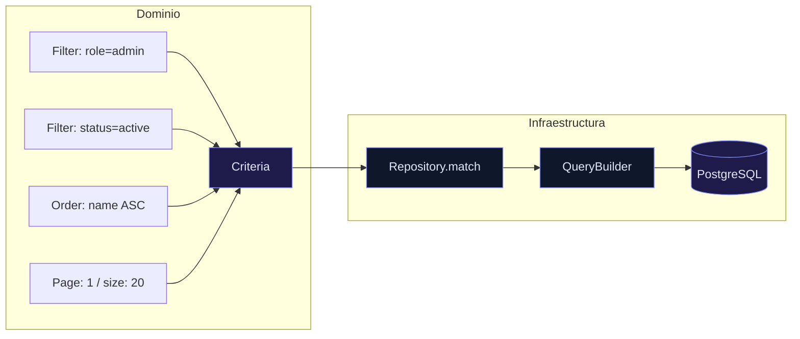

<p style="line-height:1.7; color:oklch(86.9% 0.022 252.894);">
  Cuando trabajas en aplicaciones reales, hay un momento inevitable: necesitás hacer búsquedas complejas.
</p>

<blockquote style="border-left:3px solid oklch(67.3% 0.182 276.935); padding-left:1rem; margin:1.5rem 0; color:#94A3B8; font-style:italic;">
  "Quiero buscar usuarios por rol, estado, nombre… añadir ordenación… paginar resultados… y que además el código sea limpio."
</blockquote>

<p style="line-height:1.7; color:oklch(86.9% 0.022 252.894);">
  Y ahí es donde muchas arquitecturas empiezan a deteriorarse.
</p>

<hr style="margin:2rem 0; border:none; border-top:1px solid #CBD5E1;" />

<h2 style="color:oklch(67.3% 0.182 276.935); font-weight:700; margin-top:2rem;">⚠️ El problema</h2>
<br />

<p style="line-height:1.7; color:oklch(86.9% 0.022 252.894);">
  En cuanto empezás a añadir filtros dinámicos en tus repositorios:
</p>

<ul style="line-height:1.7; color:oklch(86.9% 0.022 252.894); margin-left:1.5rem; margin-top:1rem;">
  <li>🧩 Aparecen <code style="color:oklch(67.3% 0.182 276.935);">if</code> por todas partes</li>
  <li>💣 Cada caso acaba teniendo su propia query personalizada</li>
  <li>🔄 Se pierde reutilización</li>
  <li>🧠 La lógica de negocio se mezcla con detalles de infraestructura</li>
</ul>

<p style="line-height:1.7; color:oklch(86.9% 0.022 252.894); margin-top:1rem;">
  El resultado: código difícil de mantener, extender y testear.
</p>

<hr style="margin:2rem 0; border:none; border-top:1px solid #CBD5E1;" />

<h2 style="color:oklch(67.3% 0.182 276.935); font-weight:700; margin-top:2rem;">🚀 La solución: Criteria + Specification Pattern</h2>
<br />

<h3 style="color:oklch(67.3% 0.182 276.935); font-weight:600; margin-top:1.5rem;">✅ Criteria</h3>
<p style="line-height:1.7; color:oklch(86.9% 0.022 252.894);">
  Un objeto que encapsula completamente una búsqueda: filtros, ordenación y paginación.
</p>

<h3 style="color:oklch(67.3% 0.182 276.935); font-weight:600; margin-top:1.5rem;">🧱 Specification Pattern</h3>
<p style="line-height:1.7; color:oklch(86.9% 0.022 252.894);">
  Cada filtro se modela como una <em>specification</em>: independiente, reutilizable y componible.
</p>

<h3 style="color:oklch(67.3% 0.182 276.935); font-weight:600; margin-top:1.5rem;">🔗 Composición dinámica</h3>
<p style="line-height:1.7; color:oklch(86.9% 0.022 252.894);">
  Podés combinar filtros sin modificar el repositorio:
</p>

```ts
criteria = new Criteria(filters, order, pageSize, pageNumber)
```

<h3 style="color:oklch(67.3% 0.182 276.935); font-weight:600; margin-top:1.5rem;">🎯 Resultado</h3>
<p style="line-height:1.7; color:oklch(86.9% 0.022 252.894);">
  El repositorio deja de "pensar" y solo ejecuta:
</p>

```ts
repository.match(criteria)
```



<hr style="margin:2rem 0; border:none; border-top:1px solid #CBD5E1;" />

<h2 style="color:oklch(67.3% 0.182 276.935); font-weight:700; margin-top:2rem;">⚡️ Implementación DDD-friendly</h2>
<br />

<h3 style="color:oklch(67.3% 0.182 276.935); font-weight:600; margin-top:1.5rem;">📦 Shared Domain</h3>
<p style="line-height:1.7; color:oklch(86.9% 0.022 252.894);">
  Aquí vive el core reutilizable entre todos los contextos:
</p>

<ul style="line-height:1.7; color:oklch(86.9% 0.022 252.894); margin-left:1.5rem; margin-top:0.5rem;">
  <li><code style="color:oklch(67.3% 0.182 276.935);">Criteria</code></li>
  <li><code style="color:oklch(67.3% 0.182 276.935);">Filters</code> → <code style="color:oklch(67.3% 0.182 276.935);">Field</code>, <code style="color:oklch(67.3% 0.182 276.935);">Operator</code>, <code style="color:oklch(67.3% 0.182 276.935);">Value</code></li>
  <li><code style="color:oklch(67.3% 0.182 276.935);">Order</code> → <code style="color:oklch(67.3% 0.182 276.935);">OrderBy</code>, <code style="color:oklch(67.3% 0.182 276.935);">OrderType</code></li>
  <li><code style="color:oklch(67.3% 0.182 276.935);">PageSize</code> (Value Object)</li>
  <li><code style="color:oklch(67.3% 0.182 276.935);">PageNumber</code> (Value Object)</li>
</ul>

<h3 style="color:oklch(67.3% 0.182 276.935); font-weight:600; margin-top:1.5rem;">🧩 Interfaz de repositorio en el dominio</h3>
<p style="line-height:1.7; color:oklch(86.9% 0.022 252.894);">
  Clave: el dominio no sabe nada de SQL, ORM ni infraestructura.
</p>

```ts
interface ContextRepository {
  match(criteria: Criteria): Promise<ContextAggregate[]>
}
```

<hr style="margin:2rem 0; border:none; border-top:1px solid #CBD5E1;" />

<h2 style="color:oklch(67.3% 0.182 276.935); font-weight:700; margin-top:2rem;">🏆 Ejemplo real: Code Finances</h2>
<br />

<p style="line-height:1.7; color:oklch(86.9% 0.022 252.894);">
  Así se organiza en el proyecto <strong>Code Finances</strong> aplicando Screaming Architecture:
</p>

<div style="margin-top:1rem; background:#0d1117; border:1px solid #30363d; border-radius:8px; padding:1.25rem; font-family:'Cascadia Code', monospace; font-size:0.85rem; color:#94A3B8; line-height:1.8;">
  <span style="color:oklch(67.3% 0.182 276.935);">Shared/Domain/Criteria/</span><br/>
  &nbsp;&nbsp;Criteria.ts<br/>
  &nbsp;&nbsp;Filters.ts · Field.ts · Operator.ts · Value.ts<br/>
  &nbsp;&nbsp;Order.ts · OrderBy.ts · OrderType.ts<br/>
  &nbsp;&nbsp;PageSize.ts · PageNumber.ts<br/>
  <br/>
  <span style="color:oklch(67.3% 0.182 276.935);">CashFlow/Revenue/Domain/</span><br/>
  &nbsp;&nbsp;RevenueRepository.ts &nbsp;<span style="color:#555;">← interface match(criteria)</span><br/>
  <br/>
  <span style="color:oklch(67.3% 0.182 276.935);">CashFlow/Revenue/Infra/</span><br/>
  &nbsp;&nbsp;TypeOrmRevenueRepository.ts &nbsp;<span style="color:#555;">← implementa la interfaz</span><br/>
  <br/>
  <span style="color:oklch(67.3% 0.182 276.935);">CashFlow/Revenue/App/Search/</span><br/>
  &nbsp;&nbsp;RevenuesSearcher.ts &nbsp;<span style="color:#555;">← caso de uso, construye el Criteria</span>
</div>

<hr style="margin:2rem 0; border:none; border-top:1px solid #CBD5E1;" />

<h2 style="color:oklch(67.3% 0.182 276.935); font-weight:700; margin-top:2rem;">🧠 Beneficios reales</h2>
<br />

<ul style="line-height:1.7; color:oklch(86.9% 0.022 252.894); margin-left:1.5rem;">
  <li>✅ Código limpio y mantenible</li>
  <li>♻️ Reutilización total de filtros entre contextos</li>
  <li>🔌 Independencia total del ORM</li>
  <li>🧪 Fácil de testear — el Criteria es un objeto de dominio puro</li>
  <li>🚀 Escalable a cualquier complejidad: joins, agregaciones, multi-tenant</li>
</ul>

<hr style="margin:2rem 0; border:none; border-top:1px solid #CBD5E1;" />

<h2 style="color:oklch(67.3% 0.182 276.935); font-weight:700; margin-top:2rem;">💬 Conclusión</h2>
<br />

<p style="line-height:1.7; color:oklch(86.9% 0.022 252.894);">
  El patrón Criteria no es solo una mejora técnica: es un <strong>cambio de mentalidad</strong>.
</p>

<p style="line-height:1.7; color:oklch(86.9% 0.022 252.894); margin-top:1rem;">
  Dejás de escribir queries específicas para cada caso y empezás a construir un sistema flexible que evoluciona con vos. Y lo mejor: una vez lo implementás bien, no querés volver atrás.
</p>

<hr style="margin:2rem 0; border:none; border-top:1px solid #CBD5E1;" />

<p style="font-style:italic; color:#94A3B8; line-height:1.7;">
  Publicado originalmente en <a href="https://www.linkedin.com/in/abraham-vilches-de-la-cruz-295538175/" style="color:oklch(67.3% 0.182 276.935);">LinkedIn</a>.
</p>
