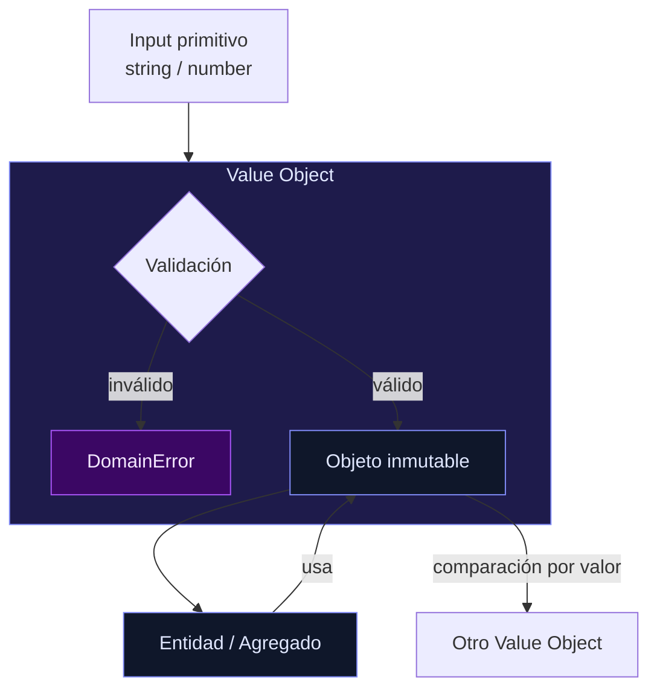

<p style="line-height:1.7; color:oklch(86.9% 0.022 252.894);">
  Volvemos con la serie de <strong>Code Finances</strong> y hoy toca una de esas piezas que parecen pequeñas… pero cambian por completo la calidad de tu diseño.
</p>

<p style="line-height:1.7; color:oklch(86.9% 0.022 252.894); margin-top:1rem;">
  Si estás trabajando con DDD o simplemente querés escribir código más robusto, esto te interesa.
</p>

<hr style="margin:2rem 0; border:none; border-top:1px solid #CBD5E1;" />

<h2 style="color:oklch(67.3% 0.182 276.935); font-weight:700; margin-top:2rem;">🤔 ¿Qué es un Value Object?</h2>
<br />

<p style="line-height:1.7; color:oklch(86.9% 0.022 252.894);">
  Un Value Object es una forma de representar datos del dominio que:
</p>

<ul style="line-height:1.7; color:oklch(86.9% 0.022 252.894); margin-left:1.5rem; margin-top:0.75rem;">
  <li>🙅‍♂️ <strong>No tienen identidad</strong></li>
  <li>📋 <strong>Se definen por sus atributos</strong></li>
  <li>🔒 <strong>Son inmutables</strong></li>
  <li>📦 <strong>Encapsulan lógica y validaciones</strong></li>
</ul>

<p style="line-height:1.7; color:oklch(86.9% 0.022 252.894); margin-top:1rem;">
  No es un simple <code style="color:oklch(67.3% 0.182 276.935);">string</code> o <code style="color:oklch(67.3% 0.182 276.935);">number</code>. Es un objeto que <strong>tiene significado dentro del negocio</strong>.
</p>

<hr style="margin:2rem 0; border:none; border-top:1px solid #CBD5E1;" />

<h2 style="color:oklch(67.3% 0.182 276.935); font-weight:700; margin-top:2rem;">⚠️ El problema sin Value Objects</h2>
<br />

<p style="line-height:1.7; color:oklch(86.9% 0.022 252.894);">
  Cuando no los usamos:
</p>

<ul style="line-height:1.7; color:oklch(86.9% 0.022 252.894); margin-left:1.5rem; margin-top:0.75rem;">
  <li>🧩 Los primitivos (<code style="color:oklch(67.3% 0.182 276.935);">string</code>, <code style="color:oklch(67.3% 0.182 276.935);">number</code>…) se reparten por todo el código</li>
  <li>❌ Las validaciones se duplican o se olvidan</li>
  <li>💣 Aparecen inconsistencias difíciles de detectar</li>
  <li>🧠 El dominio pierde expresividad</li>
</ul>

<p style="line-height:1.7; color:oklch(86.9% 0.022 252.894); margin-top:1rem;">
  Ejemplo típico:
</p>

```ts
if (percentage > 100) {
  throw new Error('Invalid percentage')
}
```

<p style="line-height:1.7; color:oklch(86.9% 0.022 252.894); margin-top:1rem;">
  ¿Dónde vive esa regla? ¿Quién la garantiza siempre?
</p>

<hr style="margin:2rem 0; border:none; border-top:1px solid #CBD5E1;" />

<h2 style="color:oklch(67.3% 0.182 276.935); font-weight:700; margin-top:2rem;">🚀 La solución: encapsular el conocimiento del dominio</h2>
<br />

<p style="line-height:1.7; color:oklch(86.9% 0.022 252.894);">
  Con Value Objects, movemos esa lógica al lugar correcto:
</p>

```ts
class LiquidityCategoryPercentage {
  constructor(private readonly value: number) {
    this.ensureIsValid(value)
  }

  private ensureIsValid(value: number) {
    if (value > 100) {
      throw new Error('Percentage cannot be greater than 100')
    }
  }

  public update(newValue: number): LiquidityCategoryPercentage {
    return new LiquidityCategoryPercentage(newValue)
  }

  public getValue(): number {
    return this.value
  }
}
```

<p style="line-height:1.7; color:oklch(86.9% 0.022 252.894); margin-top:1rem;">
  Ahora la regla vive en un solo sitio, es imposible crear un valor inválido y el dominio se protege a sí mismo.
</p>

<hr style="margin:2rem 0; border:none; border-top:1px solid #CBD5E1;" />

<h2 style="color:oklch(67.3% 0.182 276.935); font-weight:700; margin-top:2rem;">🧠 ¿Por qué usarlos?</h2>
<br />

<p style="line-height:1.7; color:oklch(86.9% 0.022 252.894);">
  En <em>Code Finances</em>, usar Value Objects nos ha dado:
</p>

<ul style="line-height:1.7; color:oklch(86.9% 0.022 252.894); margin-left:1.5rem; margin-top:0.75rem;">
  <li>✅ <strong>Validación inmediata</strong></li>
  <li>❌ <strong>Menos errores por inconsistencias</strong></li>
  <li>🗣 <strong>Mayor expresividad</strong> — <code style="color:oklch(67.3% 0.182 276.935);">Percentage</code>, <code style="color:oklch(67.3% 0.182 276.935);">Money</code>, <code style="color:oklch(67.3% 0.182 276.935);">Email</code>…</li>
  <li>🧪 <strong>Testing más simple</strong></li>
  <li>♻ <strong>Reutilización de lógica</strong></li>
  <li>🧱 <strong>Diseño más sólido y mantenible</strong></li>
</ul>

<p style="line-height:1.7; color:oklch(86.9% 0.022 252.894); margin-top:1rem;">
  Y además cumplen con <strong>SOLID</strong> de forma natural.
</p>

<hr style="margin:2rem 0; border:none; border-top:1px solid #CBD5E1;" />

<h2 style="color:oklch(67.3% 0.182 276.935); font-weight:700; margin-top:2rem;">🛠️ Caso real: regla de negocio</h2>
<br />

<p style="line-height:1.7; color:oklch(86.9% 0.022 252.894);">
  En nuestro dominio tenemos una regla clara:
</p>

<blockquote style="border-left:3px solid oklch(67.3% 0.182 276.935); padding-left:1rem; margin:1.5rem 0; color:#94A3B8; font-style:italic;">
  El porcentaje de una categoría de liquidez <strong>no puede superar el 100%</strong>, porque estarías distribuyendo más revenue del que existe.
</blockquote>

<p style="line-height:1.7; color:oklch(86.9% 0.022 252.894);">
  Esto no es un detalle técnico. Es <strong>conocimiento del negocio</strong>. Y por eso debe vivir en un Value Object.
</p>

<hr style="margin:2rem 0; border:none; border-top:1px solid #CBD5E1;" />

<h2 style="color:oklch(67.3% 0.182 276.935); font-weight:700; margin-top:2rem;">🔄 Actualización segura</h2>
<br />

<p style="line-height:1.7; color:oklch(86.9% 0.022 252.894);">
  Cuando necesitás modificar el valor, no mutás el objeto original. Creás uno nuevo válido:
</p>

```ts
const updated = percentage.update(80)
```

<ul style="line-height:1.7; color:oklch(86.9% 0.022 252.894); margin-left:1.5rem; margin-top:0.75rem;">
  <li>✔️ Inmutabilidad garantizada</li>
  <li>✔️ Estado siempre consistente</li>
</ul>

<hr style="margin:2rem 0; border:none; border-top:1px solid #CBD5E1;" />

<h2 style="color:oklch(67.3% 0.182 276.935); font-weight:700; margin-top:2rem;">🧼 Buenas prácticas</h2>
<br />

<ul style="line-height:1.7; color:oklch(86.9% 0.022 252.894); margin-left:1.5rem;">
  <li>Mantenelos <strong>inmutables</strong></li>
  <li>Validá siempre en el constructor</li>
  <li>Evitá exponer setters</li>
  <li>Usá nombres del dominio, no técnicos</li>
  <li>Hacelos pequeños y específicos</li>
</ul>

<hr style="margin:2rem 0; border:none; border-top:1px solid #CBD5E1;" />

<h2 style="color:oklch(67.3% 0.182 276.935); font-weight:700; margin-top:2rem;">⚠️ Antipatrones a evitar</h2>
<br />

<ul style="line-height:1.7; color:oklch(86.9% 0.022 252.894); margin-left:1.5rem;">
  <li>🚫 Usarlos como simples contenedores sin lógica</li>
  <li>🚫 Meter demasiada responsabilidad en un solo VO</li>
  <li>🚫 Saltarse validaciones "por conveniencia"</li>
  <li>🚫 Convertirlos en entidades encubiertas</li>
</ul>

<hr style="margin:2rem 0; border:none; border-top:1px solid #CBD5E1;" />

<h2 style="color:oklch(67.3% 0.182 276.935); font-weight:700; margin-top:2rem;">💬 Conclusión</h2>
<br />



<p style="line-height:1.7; color:oklch(86.9% 0.022 252.894);">
  Los Value Objects son esos pequeños detalles que separan código que <em>funciona</em> de código que <strong>representa el dominio correctamente</strong>.
</p>

<p style="line-height:1.7; color:oklch(86.9% 0.022 252.894); margin-top:1rem;">
  Son guardianes silenciosos que aseguran que tus datos:
</p>

<ul style="line-height:1.7; color:oklch(86.9% 0.022 252.894); margin-left:1.5rem; margin-top:0.75rem;">
  <li>✔️ Siempre sean válidos</li>
  <li>✔️ Siempre tengan sentido</li>
  <li>✔️ Siempre respeten las reglas del negocio</li>
</ul>

<p style="line-height:1.7; color:oklch(86.9% 0.022 252.894); margin-top:1rem;">
  Y cuando los adoptás bien… tu diseño cambia por completo.
</p>

<hr style="margin:2rem 0; border:none; border-top:1px solid #CBD5E1;" />

<p style="font-style:italic; color:#94A3B8; line-height:1.7;">
  Publicado originalmente en <a href="https://www.linkedin.com/in/abraham-vilches-de-la-cruz-295538175/" style="color:oklch(67.3% 0.182 276.935);">LinkedIn</a>.
</p>
