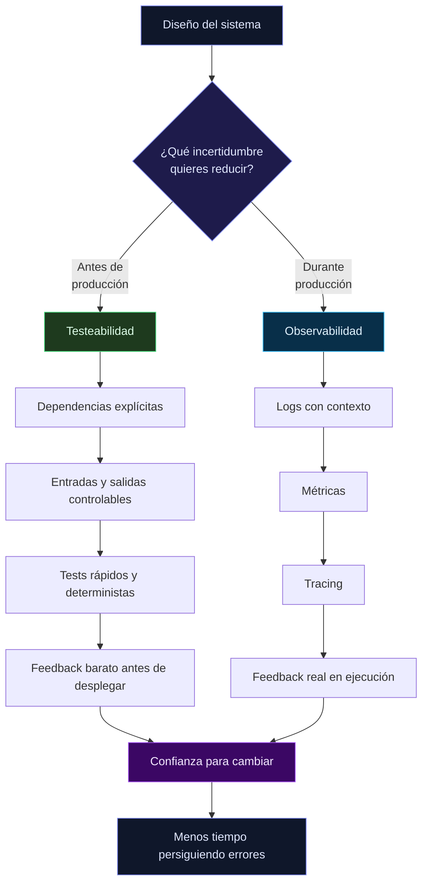

<p style="line-height:1.7; color:oklch(86.9% 0.022 252.894);">
  Hay dos conceptos que mucha gente mezcla como si fueran sinónimos: <strong>testeabilidad</strong> y <strong>observabilidad</strong>.
</p>

<p style="line-height:1.7; color:oklch(86.9% 0.022 252.894); margin-top:1rem;">
  Y no, no son lo mismo. Se relacionan, sí. Pero cumplen papeles distintos en la arquitectura de un sistema.
</p>

<blockquote style="border-left:3px solid oklch(67.3% 0.182 276.935); padding-left:1rem; margin:1.5rem 0; color:#94A3B8; font-style:italic;">
  La testeabilidad reduce incertidumbre <strong>antes</strong> de producción. La observabilidad reduce incertidumbre <strong>durante</strong> producción.
</blockquote>

<p style="line-height:1.7; color:oklch(86.9% 0.022 252.894);">
  Si confundes esas dos ideas, terminas diseñando sistemas que parecen sólidos… pero solo hasta que algo falla de verdad.
</p>

<hr style="margin:2rem 0; border:none; border-top:1px solid #CBD5E1;" />

<h2 style="color:oklch(67.3% 0.182 276.935); font-weight:700; margin-top:2rem;">🧪 ¿Qué es la testeabilidad?</h2>
<br />

<p style="line-height:1.7; color:oklch(86.9% 0.022 252.894);">
  La <strong>testeabilidad</strong> es la facilidad con la que puedes <strong>provocar estados</strong>, <strong>controlar dependencias</strong> y <strong>verificar resultados</strong> en tu software.
</p>

<p style="line-height:1.7; color:oklch(86.9% 0.022 252.894); margin-top:1rem;">
  O dicho más directo: qué tan fácil es demostrar, de forma automatizada, que una pieza del sistema se comporta como esperas.
</p>

<ul style="line-height:1.7; color:oklch(86.9% 0.022 252.894); margin-left:1.5rem; margin-top:0.75rem;">
  <li>✅ Dependencias explícitas e inyectables</li>
  <li>✅ Entradas y salidas claras</li>
  <li>✅ Poca magia y poco acoplamiento</li>
  <li>✅ Feedback rápido, repetible y determinista</li>
</ul>

<p style="line-height:1.7; color:oklch(86.9% 0.022 252.894); margin-top:1rem;">
  Un sistema testeable no es el que “tiene muchos tests”. Es el que <strong>está diseñado para que testear sea natural</strong>.
</p>

<hr style="margin:2rem 0; border:none; border-top:1px solid #CBD5E1;" />

<h2 style="color:oklch(67.3% 0.182 276.935); font-weight:700; margin-top:2rem;">📡 ¿Qué es la observabilidad?</h2>
<br />

<p style="line-height:1.7; color:oklch(86.9% 0.022 252.894);">
  La <strong>observabilidad</strong> es la capacidad de entender qué está pasando dentro de un sistema <strong>a partir de las señales que emite</strong> mientras corre en entornos reales.
</p>

<p style="line-height:1.7; color:oklch(86.9% 0.022 252.894); margin-top:1rem;">
  No se trata solo de tener logs. Se trata de poder responder preguntas como estas sin rezar:
</p>

<ul style="line-height:1.7; color:oklch(86.9% 0.022 252.894); margin-left:1.5rem; margin-top:0.75rem;">
  <li>🔍 ¿Qué request falló?</li>
  <li>📈 ¿Cuándo empezó a degradarse la latencia?</li>
  <li>🧵 ¿En qué servicio se rompió la cadena?</li>
  <li>👤 ¿A qué usuarios afectó?</li>
</ul>

<p style="line-height:1.7; color:oklch(86.9% 0.022 252.894); margin-top:1rem;">
  Para eso necesitas <strong>logs con contexto</strong>, <strong>métricas útiles</strong>, <strong>trazas</strong> y, sobre todo, señales pensadas desde el diseño.
</p>

<hr style="margin:2rem 0; border:none; border-top:1px solid #CBD5E1;" />

<h2 style="color:oklch(67.3% 0.182 276.935); font-weight:700; margin-top:2rem;">❌ El error común: enfrentarlas</h2>
<br />

<p style="line-height:1.7; color:oklch(86.9% 0.022 252.894);">
  Aquí viene la confusión típica: pensar que si un sistema es muy observable entonces no hace falta que sea tan testeable. O al revés.
</p>

<p style="line-height:1.7; color:oklch(86.9% 0.022 252.894); margin-top:1rem;">
  No. Es como tener <strong>tipado estático</strong> y <strong>logs en producción</strong>. El tipado previene clases enteras de bugs antes de que el código corra; los logs te explican qué hizo el sistema cuando los datos no eran los que esperabas. Nadie discute cuál elegir, porque atacan momentos distintos del ciclo de vida.
</p>

<div style="display:flex; gap:2rem; flex-wrap:wrap; margin-top:1rem;">
  <div style="flex:1; min-width:220px;">
    <p style="color:oklch(67.3% 0.182 276.935); font-weight:600; margin-bottom:0.5rem;">Testeabilidad</p>
    <ul style="line-height:1.7; color:oklch(86.9% 0.022 252.894); margin-left:1.25rem;">
      <li>Actúa antes del despliegue</li>
      <li>Reduce el coste de cambio</li>
      <li>Ayuda a diseñar mejor</li>
      <li>Valida comportamiento esperado</li>
    </ul>
  </div>
  <div style="flex:1; min-width:220px;">
    <p style="color:oklch(67.3% 0.182 276.935); font-weight:600; margin-bottom:0.5rem;">Observabilidad</p>
    <ul style="line-height:1.7; color:oklch(86.9% 0.022 252.894); margin-left:1.25rem;">
      <li>Actúa con el sistema en marcha</li>
      <li>Reduce el coste de diagnóstico</li>
      <li>Ayuda a operar mejor</li>
      <li>Explica comportamiento real</li>
    </ul>
  </div>
</div>

<hr style="margin:2rem 0; border:none; border-top:1px solid #CBD5E1;" />

<h2 style="color:oklch(67.3% 0.182 276.935); font-weight:700; margin-top:2rem;">🧠 La diferencia, dibujada</h2>
<br />



<hr style="margin:2rem 0; border:none; border-top:1px solid #CBD5E1;" />

<h2 style="color:oklch(67.3% 0.182 276.935); font-weight:700; margin-top:2rem;">⚖️ Casos reales: qué pasa cuando te falta una</h2>
<br />

<div style="display:grid; grid-template-columns:repeat(auto-fit, minmax(230px, 1fr)); gap:1rem; margin-top:1rem;">
  <div style="border:1px solid #334155; border-radius:0.75rem; padding:1rem; background:rgba(15,23,42,.45);">
    <p style="color:#4ade80; font-weight:700; margin-bottom:0.5rem;">Alta testeabilidad + baja observabilidad</p>
    <p style="line-height:1.7; color:oklch(86.9% 0.022 252.894);">
      Tu pipeline está en verde, pero en producción no entiendes por qué falla un flujo. Cambias con seguridad, pero operas a ciegas.
    </p>
  </div>

  <div style="border:1px solid #334155; border-radius:0.75rem; padding:1rem; background:rgba(15,23,42,.45);">
    <p style="color:#38bdf8; font-weight:700; margin-bottom:0.5rem;">Baja testeabilidad + alta observabilidad</p>
    <p style="line-height:1.7; color:oklch(86.9% 0.022 252.894);">
      Ves perfectamente el incendio en producción, pero cada fix es caro y arriesgado porque el sistema está acoplado y cuesta aislarlo.
    </p>
  </div>

  <div style="border:1px solid #334155; border-radius:0.75rem; padding:1rem; background:rgba(15,23,42,.45);">
    <p style="color:#f87171; font-weight:700; margin-bottom:0.5rem;">Baja testeabilidad + baja observabilidad</p>
    <p style="line-height:1.7; color:oklch(86.9% 0.022 252.894);">
      Caos total: no previenes errores antes ni los entiendes después. Cada cambio se siente como apostar a ciegas.
    </p>
  </div>

  <div style="border:1px solid #334155; border-radius:0.75rem; padding:1rem; background:rgba(15,23,42,.45);">
    <p style="color:oklch(67.3% 0.182 276.935); font-weight:700; margin-bottom:0.5rem;">Alta testeabilidad + alta observabilidad</p>
    <p style="line-height:1.7; color:oklch(86.9% 0.022 252.894);">
      Este es el punto sano: cambias con confianza y, si algo ocurre en producción, tienes señales para entenderlo rápido.
    </p>
  </div>
</div>

<hr style="margin:2rem 0; border:none; border-top:1px solid #CBD5E1;" />

<h2 style="color:oklch(67.3% 0.182 276.935); font-weight:700; margin-top:2rem;">🛠️ Una decisión, dos beneficios</h2>
<br />

<p style="line-height:1.7; color:oklch(86.9% 0.022 252.894);">
  En lugar de listar buenas prácticas genéricas, mejor un caso concreto. Imaginemos un caso de uso del estilo de los que tengo en <strong>Code Finances</strong>: registrar un ingreso de un usuario.
</p>

<p style="line-height:1.7; color:oklch(86.9% 0.022 252.894); margin-top:1rem;">
  La decisión de diseño es simple: el caso de uso recibe sus dependencias por constructor (puerto del repositorio + publicador de eventos) y, al completar la operación, emite un <code>RevenueRegistered</code>.
</p>

```ts
class RevenueRegistrar {
  constructor(
    private readonly repository: RevenueRepository,
    private readonly publisher: DomainEventsPublisher,
  ) {}

  async execute(request: RequestRevenueRegistrar): Promise<void> {
    const revenue = Revenue.create(input);

    await this.repository.save(revenue);

    await this.publisher.publish(revenue.pullDomainEvents());
  }
}
```

<p style="line-height:1.7; color:oklch(86.9% 0.022 252.894); margin-top:1.25rem;">
  Esa misma decisión te paga en los dos frentes:
</p>

<ul style="line-height:1.7; color:oklch(86.9% 0.022 252.894); margin-left:1.5rem; margin-top:0.5rem;">
  <li>🧪 <strong>Testeabilidad</strong>: en el test mockeo <code>RevenueRepository</code> y <code>EventPublisher</code>, ejecuto el caso de uso y verifico dos cosas: que se persistió el ingreso y que se publicó el evento. Sin frameworks de por medio, sin base de datos, sin red.</li>
  <li>🔭 <strong>Observabilidad</strong>: el handler de <code>RevenueRegistered</code> es donde vive el log estructurado con <code>correlation_id</code>, <code>user_id</code> y <code>amount</code>; ahí también incremento la métrica <code>revenues_registered_total</code>. La traza nace del evento de dominio, no contamina el caso de uso.</li>
</ul>

<p style="line-height:1.7; color:oklch(86.9% 0.022 252.894); margin-top:1.25rem;">
  Ese es el patrón a perseguir: <strong>una sola decisión de diseño que mejora ambas cualidades a la vez</strong>. De ahí salen tres principios que conviene tener siempre en la cabeza:
</p>

<ul style="line-height:1.7; color:oklch(86.9% 0.022 252.894); margin-left:1.5rem; margin-top:0.5rem;">
  <li>🔌 <strong>Dependencias explícitas</strong> — lo que entra por el constructor se mockea en tests y se instrumenta en producción.</li>
  <li>📣 <strong>Eventos de dominio como punto de instrumentación</strong> — el caso de uso se mantiene puro; logs y métricas viven en los handlers.</li>
  <li>🧭 <strong>Lenguaje del dominio</strong> — si el evento se llama <code>RevenueRegistered</code>, el test, el log y el dashboard hablan el mismo idioma.</li>
</ul>

<hr style="margin:2rem 0; border:none; border-top:1px solid #CBD5E1;" />

<h2 style="color:oklch(67.3% 0.182 276.935); font-weight:700; margin-top:2rem;">💸 Los trade-offs reales</h2>
<br />

<p style="line-height:1.7; color:oklch(86.9% 0.022 252.894);">
  Ojo: ninguna de las dos es gratis.
</p>

<ul style="line-height:1.7; color:oklch(86.9% 0.022 252.894); margin-left:1.5rem; margin-top:0.75rem;">
  <li>La <strong>testeabilidad</strong> exige diseño, disciplina y evitar atajos acoplados.</li>
  <li>La <strong>observabilidad</strong> implica coste operativo, volumen de datos y la tentación de llenar todo de ruido inútil.</li>
</ul>

<p style="line-height:1.7; color:oklch(86.9% 0.022 252.894); margin-top:1rem;">
  Por eso la conversación madura no es “¿cuál elijo?”. La conversación madura es: <strong>¿qué nivel de testeabilidad y observabilidad necesita este sistema según su criticidad y coste de fallo?</strong>
</p>

<hr style="margin:2rem 0; border:none; border-top:1px solid #CBD5E1;" />

<h2 style="color:oklch(67.3% 0.182 276.935); font-weight:700; margin-top:2rem;">💬 Conclusión</h2>
<br />

<p style="line-height:1.7; color:oklch(86.9% 0.022 252.894);">
  La testeabilidad y la observabilidad no son rivales. Son <strong>dos mecanismos distintos para bajar incertidumbre</strong> en momentos diferentes de la vida del software.
</p>

<p style="line-height:1.7; color:oklch(86.9% 0.022 252.894); margin-top:1rem;">
  Si tu sistema solo es testeable, sufrirás cuando llegue a producción. Si tu sistema solo es observable, sufrirás cada vez que necesites cambiarlo.
</p>

<p style="line-height:1.7; color:oklch(86.9% 0.022 252.894); margin-top:1rem;">
  El punto serio de ingeniería está en construir software que pueda <strong>probarse bien</strong> y también <strong>explicarse bien</strong> cuando ya está corriendo.
</p>

<p style="line-height:1.7; color:oklch(86.9% 0.022 252.894); margin-top:1rem;">
  Porque la calidad no aparece por magia. Se diseña.
</p>
